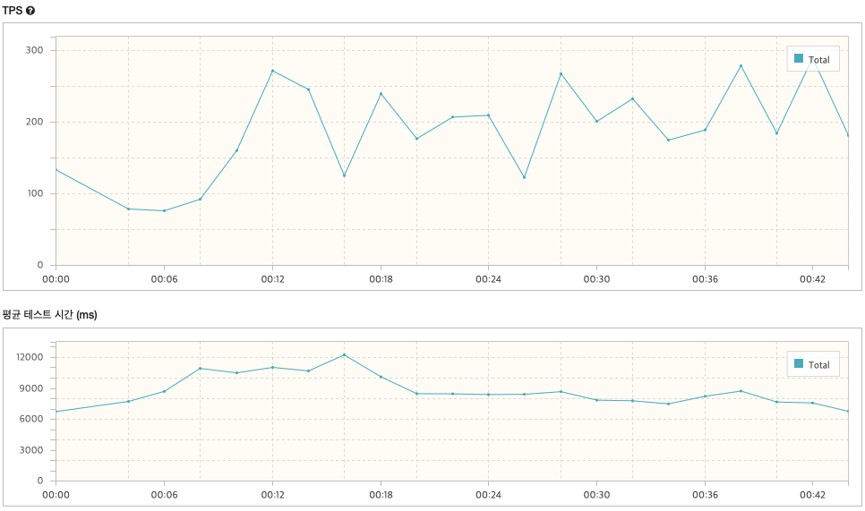

# Ngrinder 부하 테스트

### 개요

- Ngrinder 컨트롤러는 서비스가 배포된 Amazon EC2 서버에 설치
- Ngrinder Agent는 총 2대를 동시에 사용
  - 1대는 같은 EC2 서버에서 도커로 실행
  - 1대는 SSAFY 지급 노트북(`nt850xac x70b`)에서 실행
- 같은 환경에서 변수만 바꿔 여러차례 테스트를 진행했을 때의 TPS(Transaction per seconds, 초당 처리 수), MTT(Mean Test Time, 평균적으로 응답을 받기까지 걸린 시간), 에러율 등을 기준으로 결과를 판단

### 테스트 1 - 스프링 서버 분산 테스트

#### 개요

- 스프링 서버 1대로 모든 요청을 처리할 때와, `Nginx`에서 소프트웨어 로드밸런싱으로 스프링 서버 3대에 요청을 나누어 처리할 때의 성능을 비교한다.
- 전자를 상황1, 후자를 상황2라고 하겠다.
- 가상사용자(vuser)는 프로세스당 1000명, 총 2000명으로 설정
- 요청은 로그인 요청(jwt토큰을 받아오는 POST 요청)으로 1분 간 진행
- 똑같은 테스트를 스프링 서버만 껐다 켜며 각각 4번씩 진행

#### 결과

- 상황1의 테스트 4회 모두 `Too many errors`라는 메세지와 함께 테스트가 도중에 종료되었다.

- 상황2의 한 테스트 4회 모두 1분간의 테스트를 끝까지 완료했다.

- TPS와 MTT는 유의미한 차이가 없었으나, 에러율에서 뚜렷한 차이를 보였다.

  - 상황1의 에러율은 최소 51.7%, 최대 60.9%였고, 상황2는 0%~29.5%의 에러율을 보였다.

  - 상황1의 테스트는 모두 아래와 같이 에러의 비중이 계속해서 증가하다가 너무 많은 에러로 테스트가 종료되었다.

    

    - 상황1 테스트 중 가장 오래(48초) 종료되지 않고 진행된 3번째 실험의 오류 그래프

  - 상황2에서는 아래처럼 비교적 안정적인(최고값 300 이하) 오류 그래프가 나타났다.

    

    - 28.4%의 에러율이 나타난 상황2의 3번째 실험의 오류 그래프

- 평균적으로 상황1보다 상황2에서 TPS의 변동이 큰 경향이 있었으나, 상황1의 테스트는 오류로 더 일찍 종료되었기에 결론을 내리기는 힘들다.

  

  상황1의 3번째 실험의 TPS와 MTT그래프

  

  상황2의 3번째 실험의 TPS와 MTT그래프

​	
